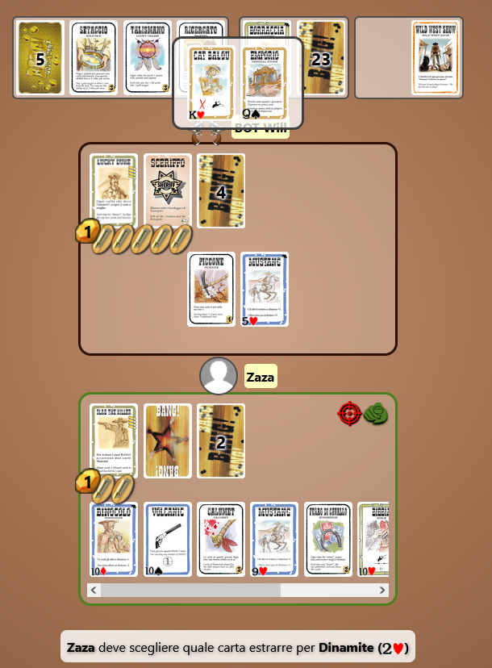
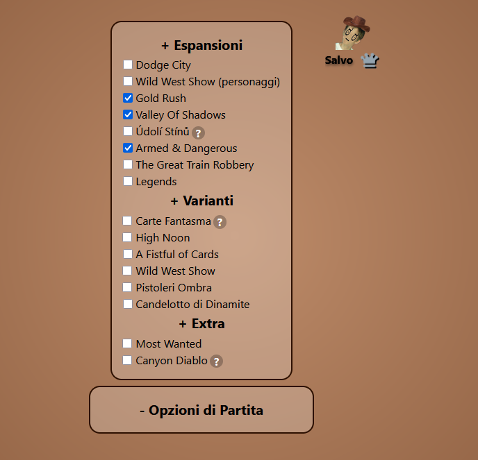

# BangWeb

A web version of the classic table game **Bang!** made with React and TypeScript.


## Table of Contents

- [Overview](#overview)
- [Features](#features)
- [Demo](#demo)
- [Getting Started](#getting-started)
  - [Prerequisites](#prerequisites)
  - [Installation](#installation)
  - [Environment Variables](#environment-variables)
  - [Running the App](#running-the-app)
- [Technologies Used](#technologies-used)
- [Contributing](#contributing)
- [Community](#community)

## Overview

[Bang.SalvoServer.it](https://bang.salvoserver.it/) recreates the famous Wild West card game "Bang!" for the web. Play online with friends, enjoy classic roles and cards, and experience the excitement of the original game in your browser.

## Features

- Online multiplayer support
- Faithful implementation of Bang! game rules with all expansions
- Intuitive and responsive interface built with React
- Real-time interaction
- Role assignment, card management, and in-game chat
- Animations and sound effects for immersive gameplay

## Screenshots




## Getting Started

### Prerequisites

- [Node.js](https://nodejs.org/) >= 16.x
- [npm](https://www.npmjs.com/) >= 8.x

### Installation

Clone the repository:

```bash
git clone https://github.com/bangsalvoserver/bangweb.git
cd bangweb
```

Install dependencies:

```bash
npm install
```

### Environment Variables

Before running the app, create a `.env` file in the root directory with the following contents:

```.env
VITE_BANG_SERVER_URL=wss://bangserver.salvoserver.it
```

- This points the client to the official Bang! server.
- If you want to run your own server (see [bang-server](https://github.com/bangsalvoserver/bang-server)), set:
  ```.env
  VITE_BANG_SERVER_URL=ws://localhost:47654
  ```

### Running the App

Start the development server (Vite default port **5173**):

```bash
npm start
```

Open [http://localhost:5173](http://localhost:5173) to view the app in your browser.

To build the app for production:

```bash
npm run build
```

## Technologies Used

- **React** — Front-end library for interactive UIs
- **TypeScript** — Type-safe JavaScript
- **Vite** — Blazing fast frontend tooling
- **CSS** — Styling
- **WebSockets** — Real-time multiplayer support
- **Node.js** — Development environment

## Contributing

Contributions, issues, and feature requests are welcome!  
Feel free to [open an issue](https://github.com/bangsalvoserver/bangweb/issues) or submit a pull request.

## Community

Join our [Discord server](https://discord.gg/jhQS6ATkgU) to chat, get support, and find other players!

---

**Bang!** is a registered trademark of daVinci Editrice S.r.l. This project is an independent, fan-made implementation and is not officially affiliated with or endorsed by the original creators.